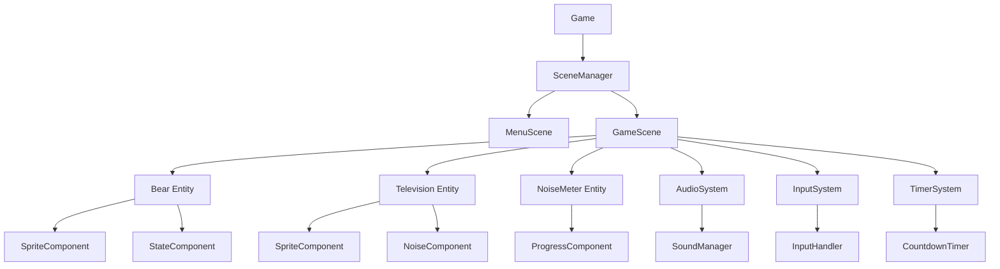
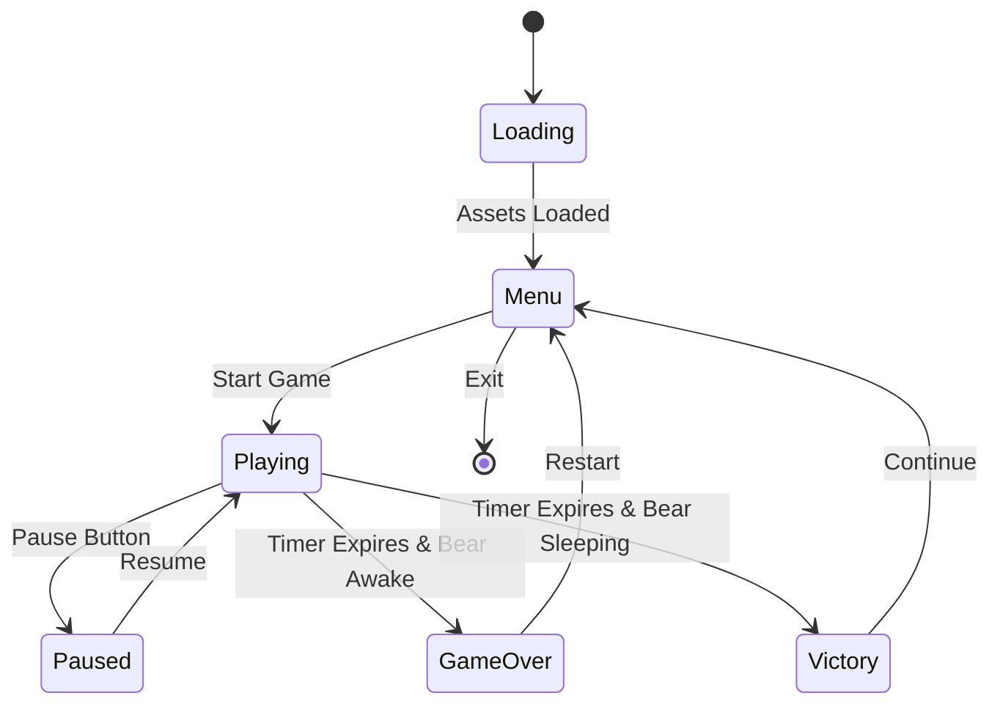

# Snooze Game - Technical Architecture Specification

## Overview

This document outlines the comprehensive technical architecture for "Snooze," a TypeScript-based web game designed as a scalable prototype for potential mobile and desktop expansion. The game will be hosted on GitHub Pages and built with modern web technologies.

## Project Requirements Summary

- **Platform**: Web-based TypeScript game
- **Framework**: Phaser 3 game engine
- **Hosting**: GitHub Pages (static hosting)
- **Target**: Modern browsers (Chrome 90+, Firefox 88+, Safari 14+)
- **Scope**: Two main screens (Game Menu, Game Screen Level 1)
- **Future**: Designed for mobile/desktop expansion

## Technology Stack

### Core Technologies
- **TypeScript 5.x** - Strong typing for scalability and maintainability
- **Phaser 3.70+** - Mature, well-documented game framework with excellent TypeScript support
- **Vite 5.x** - Fast development server, excellent TypeScript integration, simple GitHub Pages deployment
- **ES2022 Target** - Leverage latest JavaScript features for cleaner code

### Development Tools
- **ESLint + Prettier** - Code quality and consistency
- **Vitest** - Fast unit testing (Vite-native)
- **TypeDoc** - API documentation generation
- **GitHub Actions** - CI/CD for automated testing and deployment

### Asset Sources
- **OpenGameArt** - Free sprites and graphics
- **Freesound** - Open source audio assets
- **Attribution System** - Clear licensing and credit management

## Project Structure

```
snooze/
├── public/                     # Static assets served directly
│   ├── assets/
│   │   ├── sprites/           # Bear, TV, UI elements
│   │   │   ├── bear/          # Bear animation frames
│   │   │   ├── tv/            # TV states and effects
│   │   │   └── ui/            # Buttons, meters, backgrounds
│   │   ├── audio/             # Sound effects, background music
│   │   │   ├── sfx/           # Sound effects
│   │   │   └── music/         # Background music
│   │   └── fonts/             # Custom fonts if needed
│   ├── favicon.ico
│   └── manifest.json          # PWA manifest for future mobile support
├── src/
│   ├── core/                  # Core game systems
│   │   ├── Game.ts           # Main game class and configuration
│   │   ├── SceneManager.ts   # Scene transition management
│   │   └── AssetLoader.ts    # Asset loading and caching system
│   ├── scenes/               # Game scenes
│   │   ├── BaseScene.ts      # Shared scene functionality
│   │   ├── MenuScene.ts      # Main menu with start button
│   │   └── GameScene.ts      # Level 1 gameplay scene
│   ├── entities/             # Game objects
│   │   ├── BaseEntity.ts     # Base entity class
│   │   ├── Bear.ts           # Bear sprite with sleep/wake states
│   │   ├── Television.ts     # TV with noise emission logic
│   │   └── NoiseMeter.ts     # Wake-up progress bar component
│   ├── systems/              # Game systems
│   │   ├── AudioSystem.ts    # Sound management and mixing
│   │   ├── InputSystem.ts    # Input handling (mouse, keyboard, touch)
│   │   ├── TimerSystem.ts    # Game timer management (1-minute level)
│   │   └── StateSystem.ts    # Game state management
│   ├── ui/                   # UI components
│   │   ├── Button.ts         # Reusable button component
│   │   ├── ProgressBar.ts    # Progress bar component
│   │   ├── HUD.ts            # Heads-up display
│   │   └── Modal.ts          # Game over/win modal dialogs
│   ├── utils/                # Utilities
│   │   ├── Constants.ts      # Game constants and configuration
│   │   ├── EventBus.ts       # Event system for decoupled communication
│   │   ├── MathUtils.ts      # Math helpers and utilities
│   │   └── Logger.ts         # Logging system for debugging
│   ├── types/                # TypeScript definitions
│   │   ├── GameTypes.ts      # Game-specific interfaces and types
│   │   ├── AssetTypes.ts     # Asset-related type definitions
│   │   └── SystemTypes.ts    # System interfaces and contracts
│   └── main.ts               # Application entry point
├── tests/                    # Unit tests
│   ├── entities/             # Entity tests
│   ├── systems/              # System tests
│   ├── utils/                # Utility tests
│   └── setup.ts              # Test configuration
├── docs/                     # Documentation
│   ├── architecture.md       # This document
│   ├── api/                  # Generated API documentation
│   └── assets/               # Documentation assets
├── .github/
│   └── workflows/
│       ├── deploy.yml        # GitHub Actions deployment
│       └── test.yml          # Automated testing workflow
├── package.json
├── tsconfig.json
├── vite.config.ts
├── eslint.config.js
├── prettier.config.js
├── vitest.config.ts
└── README.md
```

## Core Architecture Patterns

### 1. Entity-Component-System (ECS) Inspired Design



### 2. Event-Driven Architecture

The game uses a central EventBus for decoupled communication between systems:

- **Systems** publish and subscribe to events
- **Entities** emit state changes as events
- **UI Components** react to game state events
- **Scene Transitions** triggered by events

### 3. State Management



## Key Classes & Interfaces

### Core Game Architecture

```typescript
interface IGameConfig {
  width: number;
  height: number;
  backgroundColor: string;
  physics: Phaser.Types.Physics.Arcade.ArcadeWorldConfig;
  audio: {
    volume: number;
    mute: boolean;
  };
}

class Game extends Phaser.Game {
  private sceneManager: SceneManager;
  private eventBus: EventBus;
  private audioSystem: AudioSystem;
  
  constructor(config: IGameConfig);
  public getEventBus(): EventBus;
  public getAudioSystem(): AudioSystem;
}
```

### Entity System

```typescript
interface IEntityState {
  id: string;
  active: boolean;
  position: { x: number; y: number };
  [key: string]: any;
}

abstract class BaseEntity extends Phaser.GameObjects.Container {
  protected eventBus: EventBus;
  protected state: IEntityState;
  protected components: Map<string, any>;
  
  constructor(scene: Phaser.Scene, x: number, y: number);
  abstract update(time: number, delta: number): void;
  protected emit(event: string, data?: any): void;
  protected addComponent<T>(name: string, component: T): void;
  protected getComponent<T>(name: string): T | null;
}
```

### System Interfaces

```typescript
interface ISystem {
  readonly name: string;
  initialize(): void;
  update(time: number, delta: number): void;
  destroy(): void;
  pause(): void;
  resume(): void;
}

interface IGameSystem extends ISystem {
  readonly priority: number;
  handleEvent(event: string, data?: any): void;
}
```

### Game Mechanics Implementation

```typescript
// Bear Entity with Sleep/Wake States
enum BearState {
  SLEEPING = 'sleeping',
  DROWSY = 'drowsy',
  AWAKE = 'awake'
}

class Bear extends BaseEntity {
  private currentState: BearState;
  private wakeThreshold: number;
  private currentNoise: number;
  
  public getCurrentState(): BearState;
  public addNoise(amount: number): void;
  public reduceNoise(amount: number): void;
  private updateState(): void;
  private playStateAnimation(): void;
}

// Television with Noise Emission
class Television extends BaseEntity {
  private isOn: boolean;
  private noiseLevel: number;
  private turnOnDelay: number;
  
  public turnOn(): void;
  public turnOff(): void;
  public getNoiseLevel(): number;
  private emitNoise(): void;
}

// Noise Canceling System
class NoiseMeter extends BaseEntity {
  private currentLevel: number;
  private maxLevel: number;
  private decayRate: number;
  
  public addNoise(amount: number): void;
  public activateNoiseCanceling(): void;
  public getCurrentLevel(): number;
  public getPercentage(): number;
}
```

## Asset Management Strategy

### Asset Organization

```typescript
interface IAssetManifest {
  sprites: {
    [key: string]: {
      path: string;
      frames?: number;
      frameWidth?: number;
      frameHeight?: number;
    };
  };
  audio: {
    [key: string]: {
      path: string;
      volume?: number;
      loop?: boolean;
    };
  };
  fonts: {
    [key: string]: string;
  };
}

class AssetLoader {
  private static readonly ASSET_MANIFEST: IAssetManifest = {
    sprites: {
      bear_sleeping: { path: 'assets/sprites/bear/sleeping.png', frames: 4 },
      bear_drowsy: { path: 'assets/sprites/bear/drowsy.png', frames: 4 },
      bear_awake: { path: 'assets/sprites/bear/awake.png', frames: 4 },
      tv_off: { path: 'assets/sprites/tv/off.png' },
      tv_on: { path: 'assets/sprites/tv/on.png', frames: 8 },
      noise_meter: { path: 'assets/sprites/ui/noise-meter.png' },
      button_noise_cancel: { path: 'assets/sprites/ui/noise-cancel-button.png' }
    },
    audio: {
      tv_noise: { path: 'assets/audio/sfx/tv-noise.ogg', volume: 0.7, loop: true },
      button_click: { path: 'assets/audio/sfx/button-click.ogg', volume: 0.5 },
      bear_snore: { path: 'assets/audio/sfx/bear-snore.ogg', volume: 0.3, loop: true },
      victory: { path: 'assets/audio/sfx/victory.ogg', volume: 0.8 },
      game_over: { path: 'assets/audio/sfx/game-over.ogg', volume: 0.8 }
    },
    fonts: {
      main: 'assets/fonts/game-font.woff2'
    }
  };
  
  public static preloadAssets(scene: Phaser.Scene): Promise<void>;
  public static getAsset(category: string, key: string): any;
  public static preloadScene(scene: Phaser.Scene, assets: string[]): Promise<void>;
}
```

### Asset Optimization

- **Sprites**: PNG format with transparency, optimized for web
- **Audio**: OGG primary with MP3 fallback, compressed for fast loading
- **Fonts**: WOFF2 format for modern browser support
- **Atlases**: Texture atlases for efficient sprite batching
- **Lazy Loading**: Non-critical assets loaded after initial game start

## GitHub Pages Deployment Strategy

### Vite Configuration

```typescript
// vite.config.ts
import { defineConfig } from 'vite';
import { resolve } from 'path';

export default defineConfig({
  base: '/snooze/', // GitHub repository name
  build: {
    outDir: 'dist',
    assetsDir: 'assets',
    sourcemap: true,
    rollupOptions: {
      input: {
        main: resolve(__dirname, 'index.html')
      }
    }
  },
  server: {
    port: 3000,
    open: true,
    host: true // Allow external connections for testing
  },
  resolve: {
    alias: {
      '@': resolve(__dirname, 'src')
    }
  }
});
```

### GitHub Actions Workflow

```yaml
# .github/workflows/deploy.yml
name: Deploy to GitHub Pages

on:
  push:
    branches: [ main ]
  pull_request:
    branches: [ main ]

jobs:
  test:
    runs-on: ubuntu-latest
    steps:
      - uses: actions/checkout@v4
      - uses: actions/setup-node@v4
        with:
          node-version: '18'
          cache: 'npm'
      - run: npm ci
      - run: npm run lint
      - run: npm run test
      - run: npm run build

  deploy:
    needs: test
    runs-on: ubuntu-latest
    if: github.ref == 'refs/heads/main'
    permissions:
      contents: read
      pages: write
      id-token: write
    steps:
      - uses: actions/checkout@v4
      - uses: actions/setup-node@v4
        with:
          node-version: '18'
          cache: 'npm'
      - run: npm ci
      - run: npm run build
      - uses: actions/upload-pages-artifact@v2
        with:
          path: ./dist
      - uses: actions/deploy-pages@v2
```

## Development Workflow

### Phase 1: Foundation Setup (Week 1)
1. **Project Initialization**
   - Set up Vite + TypeScript + Phaser project structure
   - Configure ESLint, Prettier, and TypeScript settings
   - Set up GitHub repository and Actions workflow

2. **Core Systems**
   - Implement basic Game class and scene management
   - Create EventBus for inter-system communication
   - Build AssetLoader with manifest system

3. **Deployment Pipeline**
   - Configure GitHub Pages deployment
   - Test build and deployment process
   - Set up development server and hot reloading

### Phase 2: Core Gameplay (Week 2)
1. **Entity Implementation**
   - Create Bear entity with sleep/wake state system
   - Implement Television with noise emission logic
   - Build NoiseMeter progress tracking system

2. **Basic Interactions**
   - Add input handling for noise canceling button
   - Implement basic game loop and state transitions
   - Create simple UI for game controls

3. **Scene Development**
   - Build MenuScene with start functionality
   - Implement GameScene with core gameplay loop
   - Add scene transition animations

### Phase 3: Game Systems (Week 3)
1. **Timer and Win Conditions**
   - Implement 1-minute level timer system
   - Add win/lose condition checking
   - Create game over and victory screens

2. **Audio Integration**
   - Implement AudioSystem with sound management
   - Add sound effects for all interactions
   - Include background audio and noise effects

3. **UI Polish**
   - Create polished UI components and HUD
   - Add progress animations and visual feedback
   - Implement responsive design for different screen sizes

### Phase 4: Testing & Optimization (Week 4)
1. **Quality Assurance**
   - Write comprehensive unit tests for core systems
   - Perform cross-browser compatibility testing
   - Optimize performance and loading times

2. **Documentation**
   - Complete API documentation with TypeDoc
   - Write user guide and development documentation
   - Create asset attribution and licensing documentation

3. **Final Polish**
   - Bug fixes and performance optimizations
   - Final UI/UX improvements
   - Prepare for potential mobile/desktop expansion

## Scalability Considerations

### Future Mobile/Desktop Expansion

**Responsive Design Patterns**
- Flexible layout system using Phaser's scale manager
- Touch-friendly UI components with appropriate sizing
- Configurable input systems supporting multiple input methods
- Adaptive asset loading based on device capabilities

**Cross-Platform Architecture**
```typescript
interface IPlatformConfig {
  inputMethod: 'mouse' | 'touch' | 'keyboard';
  screenSize: 'mobile' | 'tablet' | 'desktop';
  performance: 'low' | 'medium' | 'high';
}

class PlatformAdapter {
  public static detectPlatform(): IPlatformConfig;
  public static adaptUI(config: IPlatformConfig): void;
  public static optimizeAssets(config: IPlatformConfig): void;
}
```

**State Management for Save/Load**
```typescript
interface IGameSave {
  version: string;
  timestamp: number;
  playerProgress: {
    levelsCompleted: number;
    bestTimes: number[];
    achievements: string[];
  };
  settings: {
    audioVolume: number;
    effectsVolume: number;
    difficulty: string;
  };
}

class SaveSystem {
  public static saveGame(data: IGameSave): Promise<void>;
  public static loadGame(): Promise<IGameSave | null>;
  public static clearSave(): Promise<void>;
}
```

### Performance Optimizations

**Memory Management**
- Object pooling for frequently created/destroyed entities
- Texture atlas usage for efficient sprite batching
- Automatic cleanup of unused assets and event listeners
- Efficient garbage collection patterns

**Loading Optimizations**
- Progressive asset loading with priority system
- Preloading critical assets, lazy loading secondary assets
- Asset compression and optimization pipeline
- CDN-ready asset organization for future scaling

**Rendering Optimizations**
- Sprite batching and texture atlas usage
- Efficient animation systems with frame skipping
- Culling of off-screen objects
- Optimized particle systems for effects

### Code Quality and Maintainability

**TypeScript Best Practices**
- Comprehensive type definitions for all game systems
- Strict TypeScript configuration with no implicit any
- Interface-driven development for system contracts
- Generic types for reusable components

**Testing Strategy**
```typescript
// Example test structure
describe('Bear Entity', () => {
  let bear: Bear;
  let mockEventBus: jest.Mocked<EventBus>;

  beforeEach(() => {
    mockEventBus = createMockEventBus();
    bear = new Bear(mockScene, 0, 0, mockEventBus);
  });

  describe('noise handling', () => {
    it('should transition from sleeping to drowsy when noise threshold reached', () => {
      bear.addNoise(50);
      expect(bear.getCurrentState()).toBe(BearState.DROWSY);
    });
  });
});
```

**Documentation Standards**
- JSDoc comments for all public APIs
- Architecture decision records (ADRs) for major decisions
- Code examples and usage patterns
- Asset attribution and licensing documentation

## Configuration Files

### Package.json Scripts
```json
{
  "scripts": {
    "dev": "vite",
    "build": "tsc && vite build",
    "preview": "vite preview",
    "test": "vitest",
    "test:ui": "vitest --ui",
    "lint": "eslint src --ext ts,tsx",
    "lint:fix": "eslint src --ext ts,tsx --fix",
    "format": "prettier --write src/**/*.{ts,tsx}",
    "docs": "typedoc src/main.ts",
    "deploy": "npm run build && gh-pages -d dist"
  }
}
```

### TypeScript Configuration
```json
{
  "compilerOptions": {
    "target": "ES2022",
    "lib": ["ES2022", "DOM", "DOM.Iterable"],
    "module": "ESNext",
    "skipLibCheck": true,
    "moduleResolution": "bundler",
    "allowImportingTsExtensions": true,
    "resolveJsonModule": true,
    "isolatedModules": true,
    "noEmit": true,
    "strict": true,
    "noUnusedLocals": true,
    "noUnusedParameters": true,
    "noFallthroughCasesInSwitch": true,
    "baseUrl": ".",
    "paths": {
      "@/*": ["src/*"]
    }
  },
  "include": ["src"],
  "references": [{ "path": "./tsconfig.node.json" }]
}
```

## Conclusion

This technical architecture provides a robust, scalable foundation for the Snooze game that balances simplicity for rapid prototyping with the structure needed for future expansion. The modular design, comprehensive type system, and modern tooling choices ensure the codebase can grow from a simple web prototype to a full commercial game across multiple platforms.

The architecture emphasizes:
- **Maintainability** through clear separation of concerns and comprehensive typing
- **Scalability** through modular systems and event-driven architecture  
- **Performance** through optimized asset management and efficient rendering
- **Developer Experience** through modern tooling and comprehensive documentation
- **Future-Proofing** through platform-agnostic design patterns

This foundation will enable rapid iteration during the prototype phase while maintaining the code quality and architecture needed for long-term success.