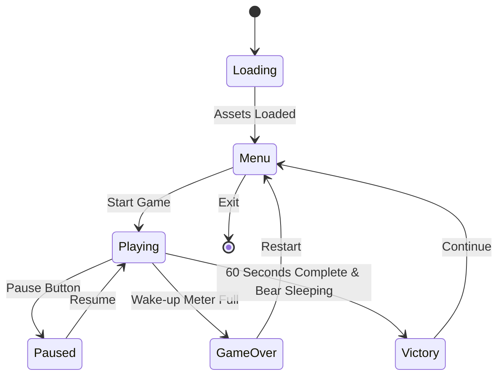

# Snooze Game - Design Specification

## Overview

This document provides the comprehensive game design specification for "Snooze," a web-based TypeScript game built with Phaser 3. The game challenges players to keep a sleeping bear from waking up for 1 minute by managing noise levels with a noise canceling machine.

**Core Concept**: Keep a sleeping bear asleep for 60 seconds while a TV randomly turns on and creates noise that threatens to wake the bear.

## Game Flow & State Management

### State Diagram



### Menu Screen Specifications

**Layout & Composition**:
- **Screen Resolution**: 800x600 pixels (4:3 aspect ratio)
- **Title Position**: Centered horizontally, 120px from top
- **Start Button**: Centered horizontally, 320px from top
- **Instructions Button**: Centered horizontally, 380px from top
- **Background**: Gradient from `#E8D5E8` (top) to `#C8B5C8` (bottom)

**UI Elements**:
- **Game Title**: "SNOOZE" in retro-style font, 48px size, color `#6B4C6B`
- **Subtitle**: "Keep the Bear Sleeping" in 24px, color `#8A6B8A`
- **Start Button**: 200x60px, rounded corners (12px radius)
- **Instructions Button**: 200x50px, rounded corners (10px radius)

**Visual Style**:
- **Button Colors**: Primary `#A8C8A8`, hover `#98B898`, pressed `#88A888`
- **Text Color**: `#4A4A4A` for button text
- **Drop Shadow**: 2px offset, 4px blur, `rgba(0,0,0,0.2)`

### Game Screen Layout

**Screen Zones**:
- **Bear Zone**: Left third of screen (0-266px width)
- **TV Zone**: Right third of screen (534-800px width)  
- **UI Zone**: Bottom 100px height for controls and meters
- **Background**: Center third for environmental elements

**Element Positioning**:
- **Bear**: Position (150, 300) - center-left of screen
- **TV**: Position (650, 200) - upper-right area
- **Wake-up Meter**: Position (400, 520) - bottom center
- **Noise Cancel Button**: Position (400, 560) - below meter
- **Timer Display**: Position (400, 50) - top center
- **Pause Button**: Position (750, 50) - top right

### State Transitions

**Loading to Menu**:
- **Duration**: 2 seconds minimum for asset loading
- **Animation**: Fade in from black
- **Audio**: Soft ambient tone on completion

**Menu to Playing**:
- **Trigger**: Start button click
- **Animation**: Slide transition (300ms ease-out)
- **Audio**: Button click sound + game start chime

**Playing to Victory/GameOver**:
- **Victory Trigger**: Timer reaches 60 seconds AND wake-up meter < 100%
- **GameOver Trigger**: Wake-up meter reaches 100%
- **Animation**: Modal overlay with bounce effect
- **Audio**: Victory fanfare OR defeat sound

## Core Game Mechanics

### TV Activation System

**Timing Specifications**:
- **Initial Delay**: Random between 3-20 seconds after game start
- **Subsequent Activations**: Random between 5-25 seconds after TV turns off
- **Active Duration**: Random between 8-15 seconds per activation
- **Total Activations**: Approximately 4-6 times during 60-second game

**TV States**:
1. **Off State**: Static screen, no noise emission
2. **Turning On**: 0.5-second transition with static effect
3. **On State**: Animated static/snow pattern, full noise emission
4. **Turning Off**: 0.3-second fade to black

**Noise Emission**:
- **Noise Level**: 15 units per second when TV is on
- **Range**: Affects bear regardless of distance (global effect)
- **Audio**: Looping TV static sound at 70% volume

### Wake-up Meter System

**Meter Specifications**:
- **Total Capacity**: 100 units (0-100%)
- **Visual Representation**: Horizontal progress bar, 300px width x 20px height
- **Color Gradient**: Green (0-33%) → Yellow (34-66%) → Red (67-100%)
- **Border**: 2px solid `#6B4C6B`

**Behavior Rules**:
- **Increase Rate**: +15 units/second when TV noise is active AND noise canceling is OFF
- **Decrease Rate**: -8 units/second when noise canceling is ON (regardless of TV state)
- **Idle State**: No change when TV is off AND noise canceling is off
- **Maximum**: Cannot exceed 100 units
- **Minimum**: Cannot go below 0 units

**Visual Feedback**:
- **Increasing**: Pulsing red glow around meter
- **Decreasing**: Soft blue glow around meter
- **Critical Level (80%+)**: Rapid pulsing animation
- **Full Meter**: Flashing red with warning icon

### Noise Canceling Machine

**Interaction Method**: Hold-to-Activate
- **Input**: Mouse button hold OR spacebar hold OR touch and hold
- **Activation**: Immediate response on input down
- **Deactivation**: Immediate response on input up
- **No Cooldown**: Can be activated/deactivated instantly

**Visual Feedback**:
- **Button Design**: 120px diameter circular button
- **Inactive State**: `#A8C8A8` background, `#6B4C6B` border
- **Active State**: `#88A888` background, glowing `#98B898` border
- **Hold Animation**: Pulsing scale effect (100% to 105% and back)
- **Icon**: Stylized sound wave with "X" overlay

**Audio Feedback**:
- **Activation Sound**: Soft "whoosh" sound (0.3 seconds)
- **Active Loop**: Subtle white noise at 30% volume
- **Deactivation Sound**: Gentle "click" sound (0.2 seconds)

**Effectiveness**:
- **Noise Reduction**: Completely negates TV noise while active
- **Meter Reduction**: -8 units/second while held down
- **Energy Cost**: None (unlimited use)

### Timer System

**Duration**: Exactly 60 seconds
- **Display Format**: "MM:SS" (e.g., "01:00", "00:45", "00:00")
- **Update Frequency**: Every 100ms for smooth countdown
- **Visual Style**: 32px font, `#6B4C6B` color, centered at top

**Critical Time Warnings**:
- **30 seconds remaining**: Timer turns orange `#D4A574`
- **10 seconds remaining**: Timer turns red `#D47474` with pulsing
- **5 seconds remaining**: Rapid pulsing with audio beeps

### Win/Lose Conditions

**Victory Conditions** (ALL must be true):
1. Timer reaches exactly 00:00
2. Wake-up meter is below 100%
3. Game state is "Playing" (not paused)

**Defeat Conditions** (ANY triggers loss):
1. Wake-up meter reaches exactly 100%
2. Player quits/exits during gameplay

**End Game Sequence**:
- **Victory**: 2-second delay, then victory modal with celebration animation
- **Defeat**: Immediate game over modal with bear waking animation

## Visual Design Guidelines

### 1980s Vintage Color Palette

**Primary Colors**:
- **Dusty Rose**: `#D4A5A5` - Primary UI elements, buttons
- **Sage Green**: `#A8C8A8` - Secondary elements, success states
- **Muted Purple**: `#B5A8C8` - Accent elements, highlights
- **Soft Lavender**: `#C8B5D4` - Background elements, gradients

**Supporting Colors**:
- **Cream**: `#F5F0E8` - Text backgrounds, light elements
- **Charcoal**: `#4A4A4A` - Primary text, borders
- **Warm Gray**: `#8A8A8A` - Secondary text, disabled states
- **Deep Purple**: `#6B4C6B` - Dark accents, important text

**Semantic Colors**:
- **Success Green**: `#88B888` - Victory states, positive feedback
- **Warning Orange**: `#D4A574` - Caution states, medium alerts
- **Danger Red**: `#D47474` - Error states, critical alerts
- **Info Blue**: `#7494D4` - Information, neutral feedback

### UI Component Styling

**Buttons**:
- **Primary Button**: Background `#A8C8A8`, border `#88A888`, text `#4A4A4A`
- **Secondary Button**: Background `#D4A5A5`, border `#C49595`, text `#4A4A4A`
- **Hover Effect**: 10% darker background, 2px raised shadow
- **Active Effect**: 5% darker background, 1px inset shadow
- **Border Radius**: 8px for small buttons, 12px for large buttons
- **Typography**: 16px font, semi-bold weight

**Progress Bars**:
- **Container**: 2px border `#6B4C6B`, background `#F5F0E8`
- **Fill Colors**: 
  - 0-33%: `#88B888` (success green)
  - 34-66%: `#D4A574` (warning orange)  
  - 67-100%: `#D47474` (danger red)
- **Animation**: Smooth transitions (200ms ease-out)
- **Height**: 20px with 4px internal padding

**Typography**:
- **Primary Font**: "Orbitron" or fallback to monospace
- **Secondary Font**: "Roboto" or fallback to sans-serif
- **Heading Sizes**: H1 (48px), H2 (32px), H3 (24px)
- **Body Text**: 16px regular, 18px for important UI text
- **Line Height**: 1.4 for readability

### Character & Object Design

**Bear Character**:
- **Style**: Cartoon/anime aesthetic with soft, rounded features
- **Size**: Approximately 120x100 pixels
- **Color Scheme**: Warm brown `#8B6F47` with lighter belly `#D4C4A8`
- **Sleep States**:
  - **Deep Sleep**: Closed eyes, gentle breathing animation, "Z" particles
  - **Light Sleep**: Slightly open eyes, slower breathing, fewer "Z" particles
  - **Drowsy**: Half-open eyes, restless movement, no "Z" particles
  - **Awake**: Fully open eyes, alert posture, surprised expression

**Television**:
- **Style**: Retro CRT TV with wood-grain frame
- **Size**: Approximately 100x80 pixels
- **Color Scheme**: Wood brown `#8B4513` frame, dark screen `#2A2A2A`
- **States**:
  - **Off**: Black screen with subtle reflection
  - **Static**: Animated black/white noise pattern
  - **Glow Effect**: Soft blue glow around screen when on

**Background Elements**:
- **Room Setting**: Cozy living room with 1980s decor
- **Color Scheme**: Warm earth tones with vintage patterns
- **Elements**: Bookshelf, lamp, rug, wall art in muted vintage colors
- **Lighting**: Soft ambient lighting with warm color temperature

### Screen Layout & Composition

**Visual Hierarchy**:
1. **Primary Focus**: Bear (largest, center-left positioning)
2. **Secondary Focus**: Wake-up meter (prominent bottom placement)
3. **Tertiary Elements**: TV, timer, controls (supporting positions)

**Spacing Guidelines**:
- **Minimum Padding**: 20px from screen edges
- **Element Spacing**: 16px between related elements, 32px between sections
- **Button Spacing**: 12px between buttons in groups
- **Text Spacing**: 8px between text lines, 16px between paragraphs

**Responsive Considerations**:
- **Minimum Resolution**: 800x600 pixels
- **Aspect Ratio**: Maintain 4:3 ratio for consistent layout
- **Scaling**: Elements scale proportionally with screen size
- **Touch Targets**: Minimum 44px for mobile compatibility

## Audio Design Specification

### Sound Effect Library

**UI Sounds**:
- **Button Click**: Sharp, satisfying click (0.1s duration, 50% volume)
- **Button Hover**: Subtle tone shift (0.05s duration, 30% volume)
- **Menu Transition**: Soft whoosh (0.3s duration, 40% volume)
- **Modal Open**: Gentle chime (0.4s duration, 60% volume)

**Gameplay Sounds**:
- **TV Turn On**: Static burst with electrical hum (0.5s duration, 70% volume)
- **TV Static**: Looping white noise (continuous, 70% volume)
- **TV Turn Off**: Electrical pop with fade (0.3s duration, 60% volume)
- **Noise Cancel On**: Soft activation whoosh (0.3s duration, 50% volume)
- **Noise Cancel Loop**: Subtle white noise (continuous, 30% volume)
- **Noise Cancel Off**: Gentle click (0.2s duration, 40% volume)

**Bear Sounds**:
- **Snoring**: Gentle, rhythmic breathing (looping, 30% volume)
- **Restless**: Soft movement sounds (0.5s duration, 40% volume)
- **Wake Up**: Surprised grunt or yawn (1.0s duration, 60% volume)

**Feedback Sounds**:
- **Meter Increase**: Rising tension tone (pitch increases with level, 40% volume)
- **Meter Decrease**: Calming descending tone (0.3s duration, 35% volume)
- **Critical Warning**: Urgent beeping (0.2s intervals, 70% volume)
- **Victory**: Triumphant fanfare (3.0s duration, 80% volume)
- **Defeat**: Disappointed trombone (2.0s duration, 70% volume)

### Audio State Management

**Dynamic Audio Mixing**:
- **Base Layer**: Ambient room tone (continuous, 20% volume)
- **Bear Layer**: Snoring when sleeping (continuous, 30% volume)
- **TV Layer**: Static when on (continuous, 70% volume)
- **UI Layer**: Button clicks and feedback (event-based, 50% volume)
- **Noise Cancel Layer**: White noise when active (continuous, 30% volume)

**Audio Ducking**:
- **TV Audio**: Reduces to 30% when noise canceling is active
- **Bear Snoring**: Stops when wake-up meter > 50%
- **UI Sounds**: Always at full volume for clarity
- **Victory/Defeat**: Fades all other audio to 10% during playback

**Spatial Audio** (Optional Enhancement):
- **Bear Position**: Slight left channel emphasis
- **TV Position**: Slight right channel emphasis
- **UI Elements**: Centered audio positioning
- **Ambient**: Full stereo spread

### Volume Balance Guidelines

**Master Volume Levels**:
- **Critical Sounds**: 70-80% (victory, defeat, warnings)
- **Gameplay Sounds**: 50-70% (TV, noise canceling, bear)
- **UI Sounds**: 40-60% (buttons, transitions)
- **Ambient Sounds**: 20-40% (background, subtle effects)

**Dynamic Range**:
- **Quiet Moments**: Ambient + bear snoring only
- **Active Moments**: Full audio mix with TV static
- **Tense Moments**: Increased meter warning sounds
- **Climax Moments**: Victory/defeat at maximum impact

## User Experience Flow

### Player Onboarding

**First-Time Experience**:
1. **Loading Screen**: Brief game concept explanation during asset loading
2. **Menu Screen**: Clear "Start Game" call-to-action
3. **Instructions Modal**: Optional detailed gameplay explanation
4. **First Game**: Contextual hints during initial 10 seconds

**Instructions Content**:
- **Objective**: "Keep the bear sleeping for 60 seconds"
- **TV Behavior**: "The TV will turn on randomly and create noise"
- **Noise Canceling**: "Hold the button to activate noise canceling"
- **Wake-up Meter**: "Don't let the meter fill completely"
- **Controls**: Visual diagram showing button/key inputs

**Tutorial Considerations**:
- **Progressive Disclosure**: Introduce concepts as they become relevant
- **Visual Cues**: Highlight interactive elements on first use
- **Practice Mode**: Optional simplified version for learning
- **Skip Option**: Allow experienced players to bypass instructions

### Feedback Systems

**Visual Feedback**:
- **Immediate Response**: All interactions provide instant visual confirmation
- **State Changes**: Clear visual transitions between game states
- **Progress Indication**: Wake-up meter provides constant status awareness
- **Success/Failure**: Unmistakable victory and defeat presentations

**Audio Feedback**:
- **Action Confirmation**: Every player action produces appropriate sound
- **State Awareness**: Audio cues indicate current game state
- **Emotional Response**: Music and effects support game tension/relief
- **Accessibility**: Visual information also conveyed through audio

**Haptic Feedback** (Future Mobile Support):
- **Button Press**: Light vibration on touch interactions
- **Critical States**: Stronger vibration when meter reaches 80%+
- **Victory/Defeat**: Distinct vibration patterns for end states

### Accessibility Considerations

**Visual Accessibility**:
- **Color Contrast**: All text meets WCAG AA standards (4.5:1 ratio minimum)
- **Color Independence**: Game state never relies solely on color
- **Text Size**: Minimum 16px for all interactive elements
- **Focus Indicators**: Clear keyboard navigation highlights

**Motor Accessibility**:
- **Input Options**: Support for mouse, keyboard, and touch
- **Hold Alternative**: Option to toggle noise canceling instead of hold
- **Large Targets**: Minimum 44px touch targets for mobile
- **Timing**: No time-critical inputs requiring precise timing

**Cognitive Accessibility**:
- **Clear Instructions**: Simple, jargon-free language
- **Consistent Layout**: Predictable element positioning
- **Error Prevention**: Confirmation for destructive actions
- **Progress Indication**: Always show current game state

**Audio Accessibility**:
- **Visual Alternatives**: All audio cues have visual equivalents
- **Volume Control**: Independent volume sliders for different audio types
- **Subtitle Support**: Text display for important audio information
- **Audio Description**: Optional narration of visual events

## Technical Integration Guidelines

### Phaser 3 Implementation Notes

**Scene Architecture**:
- **MenuScene**: Implements menu layout with button event handlers
- **GameScene**: Contains all gameplay entities and systems
- **UI Components**: Reusable classes for buttons, progress bars, modals
- **Asset Loading**: Preload all assets in loading scene for smooth gameplay

**Entity Mapping**:
- **Bear Entity**: Maps to [`src/entities/Bear.ts`](src/entities/Bear.ts) with state management
- **Television Entity**: Maps to [`src/entities/Television.ts`](src/entities/Television.ts) with timing system
- **NoiseMeter Entity**: Maps to [`src/entities/NoiseMeter.ts`](src/entities/NoiseMeter.ts) with progress tracking

**System Integration**:
- **AudioSystem**: Handles all sound effect playback and mixing
- **InputSystem**: Manages hold-to-activate noise canceling input
- **TimerSystem**: Tracks 60-second countdown with precision
- **StateSystem**: Coordinates game state transitions

### Asset Requirements

**Sprite Specifications**:
- **Format**: PNG with transparency
- **Resolution**: 2x scale for retina displays (actual size × 2)
- **Naming Convention**: `entity_state_frame.png` (e.g., `bear_sleeping_01.png`)
- **Animation Frames**: 4 frames per animation at 8 FPS

**Audio Specifications**:
- **Format**: OGG primary, MP3 fallback
- **Sample Rate**: 44.1kHz for music, 22kHz for effects
- **Bit Depth**: 16-bit for web optimization
- **Compression**: Moderate compression for balance of quality/size

**Font Requirements**:
- **Format**: WOFF2 for modern browsers, WOFF fallback
- **Weights**: Regular (400) and Semi-Bold (600)
- **Character Set**: Basic Latin + common punctuation
- **Fallbacks**: System fonts for compatibility

### Performance Considerations

**Rendering Optimization**:
- **Sprite Batching**: Group similar sprites for efficient rendering
- **Texture Atlases**: Combine small sprites into single textures
- **Object Pooling**: Reuse particle objects for "Z" animations
- **Culling**: Hide off-screen elements to improve performance

**Memory Management**:
- **Asset Cleanup**: Destroy unused assets between scenes
- **Event Listeners**: Properly remove listeners to prevent memory leaks
- **Animation Cleanup**: Stop and destroy completed animations
- **Garbage Collection**: Minimize object creation during gameplay

**Loading Optimization**:
- **Critical Path**: Load essential assets first for quick start
- **Progressive Loading**: Load non-critical assets in background
- **Compression**: Optimize all assets for web delivery
- **Caching**: Implement proper browser caching headers

## Detailed Specifications

### Precise Timing Values

**Game Loop Timing**:
- **Update Frequency**: 60 FPS (16.67ms per frame)
- **Timer Precision**: Update every 100ms for smooth countdown
- **Animation Speed**: 8 FPS for character animations (125ms per frame)
- **UI Transitions**: 200-300ms for smooth user experience

**Gameplay Timing**:
- **TV Random Delay**: `Math.random() * 17000 + 3000` (3-20 seconds)
- **TV Active Duration**: `Math.random() * 7000 + 8000` (8-15 seconds)
- **Meter Update Rate**: 60 times per second (every frame)
- **Audio Fade Duration**: 500ms for smooth transitions

### Measurement Units

**Screen Coordinates** (800x600 base resolution):
- **Bear Position**: (150, 300) - 150px from left, 300px from top
- **TV Position**: (650, 200) - 650px from left, 200px from top
- **Meter Position**: (250, 520) - centered horizontally, 520px from top
- **Button Position**: (340, 560) - centered horizontally, 560px from top

**Element Sizes**:
- **Bear Sprite**: 120x100 pixels
- **TV Sprite**: 100x80 pixels
- **Wake-up Meter**: 300x20 pixels
- **Noise Cancel Button**: 120x120 pixels (circular)
- **Modal Dialogs**: 400x300 pixels

**Spacing Standards**:
- **Screen Padding**: 20px minimum from edges
- **Element Spacing**: 16px between related elements
- **Button Groups**: 12px between buttons
- **Text Line Height**: 1.4 × font size

### Asset File Specifications

**Directory Structure**:
```
public/assets/
├── sprites/
│   ├── bear/
│   │   ├── sleeping_01.png (240x200px)
│   │   ├── sleeping_02.png (240x200px)
│   │   ├── drowsy_01.png (240x200px)
│   │   └── awake_01.png (240x200px)
│   ├── tv/
│   │   ├── off.png (200x160px)
│   │   ├── on_01.png (200x160px)
│   │   └── static_sheet.png (1600x160px, 8 frames)
│   └── ui/
│       ├── meter_bg.png (600x40px)
│       ├── meter_fill.png (596x36px)
│       └── noise_button.png (240x240px)
├── audio/
│   ├── sfx/
│   │   ├── tv_static.ogg (looping)
│   │   ├── button_click.ogg (0.1s)
│   │   ├── noise_cancel_on.ogg (0.3s)
│   │   └── victory.ogg (3.0s)
│   └── music/
│       └── ambient.ogg (60s loop)
└── fonts/
    ├── orbitron-regular.woff2
    └── orbitron-semibold.woff2
```

**Naming Conventions**:
- **Sprites**: `entity_state_frame.png`
- **Audio**: `category_description.ogg`
- **Fonts**: `family-weight.woff2`
- **UI Elements**: `component_state.png`

## Conclusion

This comprehensive game design specification provides the complete blueprint for implementing "Snooze" within the established technical architecture. The specification includes:

- **Precise Mechanics**: Exact timing, measurements, and behavioral rules
- **Visual Guidelines**: Complete 1980s vintage aesthetic with specific color codes
- **Audio Design**: Comprehensive sound library with volume balancing
- **User Experience**: Accessibility considerations and player onboarding
- **Technical Integration**: Direct mapping to the Phaser 3 architecture

The design emphasizes:
- **Engaging Gameplay**: Hold-to-activate mechanics require active player attention
- **Visual Appeal**: Cohesive 1980s vintage aesthetic with cartoon charm
- **Accessibility**: Inclusive design supporting diverse player needs
- **Technical Excellence**: Optimized for web deployment and future expansion

This specification serves as the definitive guide for developers, artists, and designers to implement the complete "Snooze" game experience while maintaining consistency with the established technical architecture.